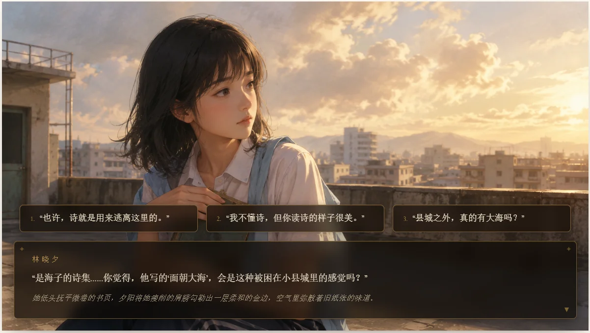
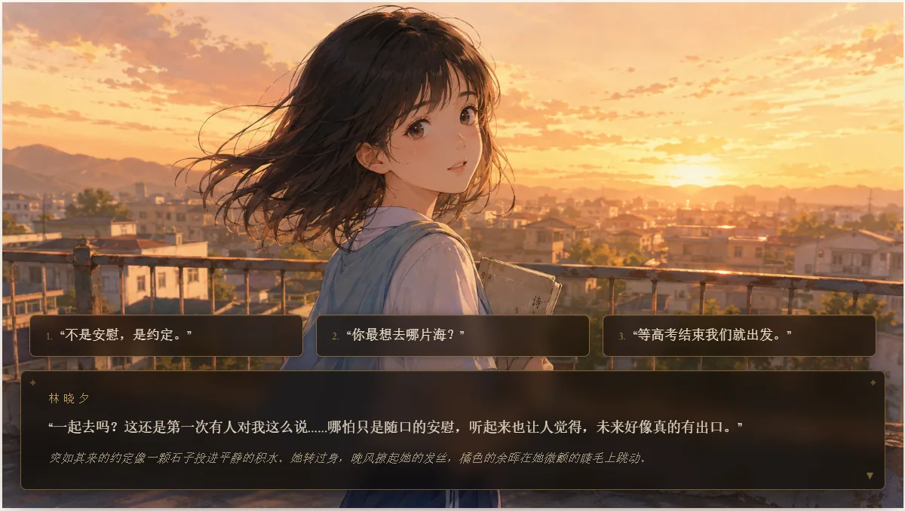
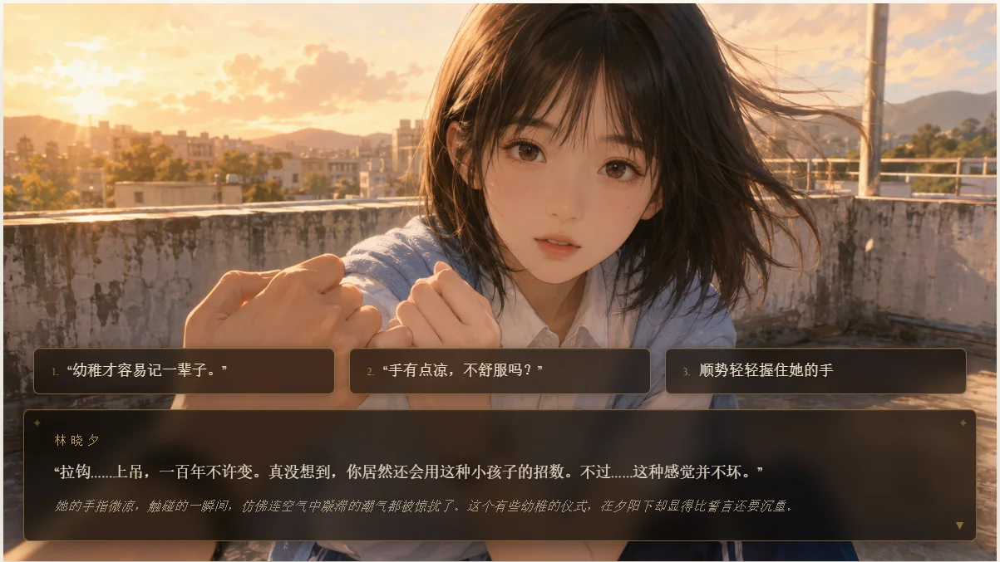
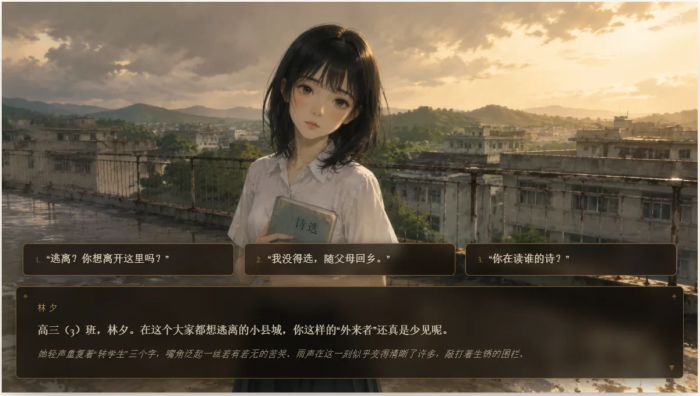
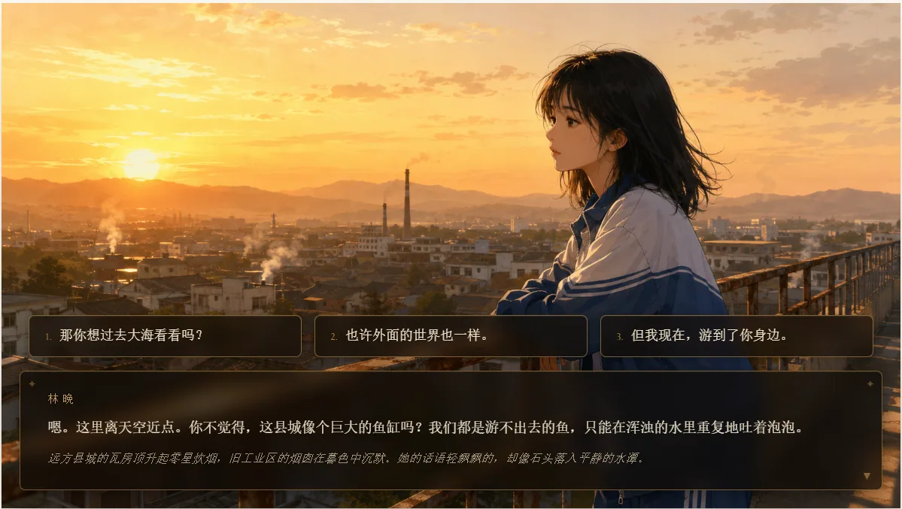
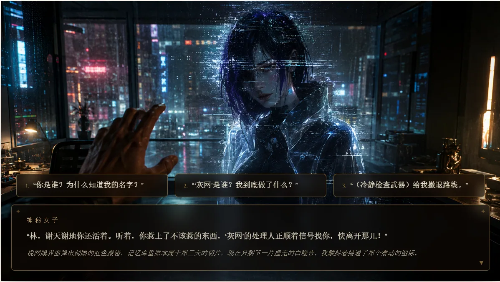
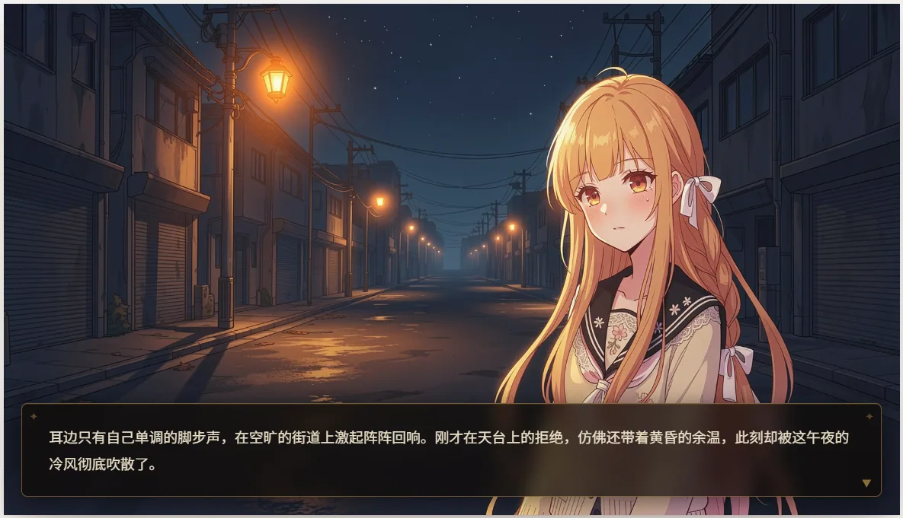
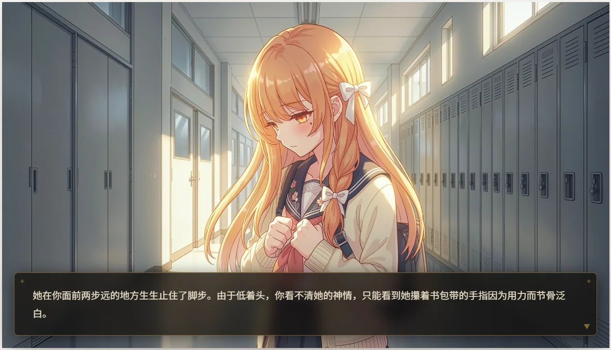
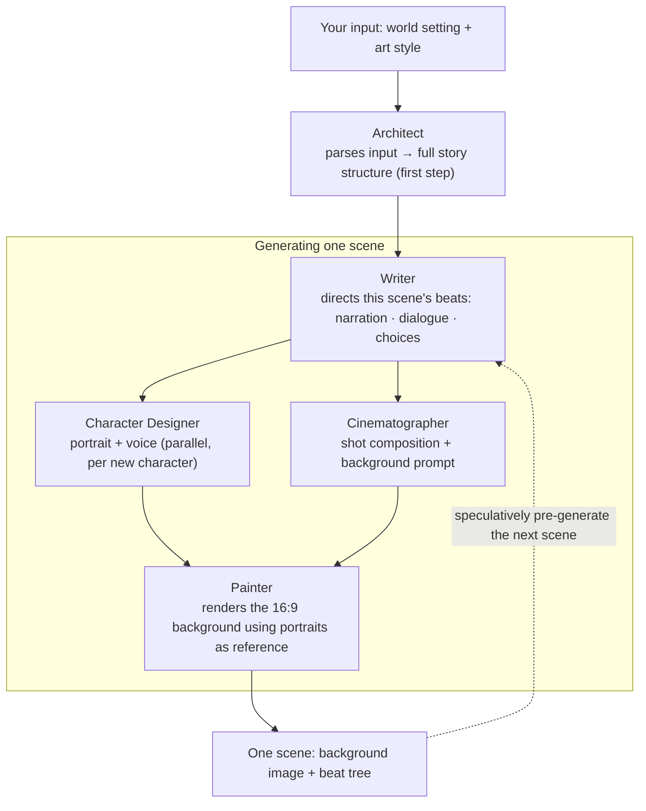

<b>An interactive story game, generated in real time for you</b>

[![LINUX DO](https://img.shields.io/badge/LINUX-DO-FFB003?style=flat-square&logo=data:image/svg%2bxml;base64,DQo8c3ZnIHhtbG5zPSJodHRwOi8vd3d3LnczLm9yZy8yMDAwL3N2ZyIgd2lkdGg9IjEwMCIgaGVpZ2h0PSIxMDAiPjxwYXRoIGQ9Ik00Ni44Mi0uMDU1aDYuMjVxMjMuOTY5IDIuMDYyIDM4IDIxLjQyNmM1LjI1OCA3LjY3NiA4LjIxNSAxNi4xNTYgOC44NzUgMjUuNDV2Ni4yNXEtMi4wNjQgMjMuOTY4LTIxLjQzIDM4LTExLjUxMiA3Ljg4NS0yNS40NDUgOC44NzRoLTYuMjVxLTIzLjk3LTIuMDY0LTM4LjAwNC0yMS40M1EuOTcxIDY3LjA1Ni0uMDU0IDUzLjE4di02LjQ3M0MxLjM2MiAzMC43ODEgOC41MDMgMTguMTQ4IDIxLjM3IDguODE3IDI5LjA0NyAzLjU2MiAzNy41MjcuNjA0IDQ2LjgyMS0uMDU2IiBzdHlsZT0ic3Ryb2tlOm5vbmU7ZmlsbC1ydWxlOmV2ZW5vZGQ7ZmlsbDojZWNlY2VjO2ZpbGwtb3BhY2l0eToxIi8+PHBhdGggZD0iTTQ3LjI2NiAyLjk1N3EyMi41My0uNjUgMzcuNzc3IDE1LjczOGE0OS43IDQ5LjcgMCAwIDEgNi44NjcgMTAuMTU3cS00MS45NjQuMjIyLTgzLjkzIDAgOS43NS0xOC42MTYgMzAuMDI0LTI0LjM4N2E2MSA2MSAwIDAgMSA5LjI2Mi0xLjUwOCIgc3R5bGU9InN0cm9rZTpub25lO2ZpbGwtcnVsZTpldmVub2RkO2ZpbGw6IzE5MTkxOTtmaWxsLW9wYWNpdHk6MSIvPjxwYXRoIGQ9Ik03Ljk4IDcwLjkyNmMyNy45NzctLjAzNSA1NS45NTQgMCA4My45My4xMTNRODMuNDI2IDg3LjQ3MyA2Ni4xMyA5NC4wODZxLTE4LjgxIDYuNTQ0LTM2LjgzMi0xLjg5OC0xNC4yMDMtNy4wOS0yMS4zMTctMjEuMjYyIiBzdHlsZT0ic3Ryb2tlOm5vbmU7ZmlsbC1ydWxlOmV2ZW5vZGQ7ZmlsbDojZjlhZjAwO2ZpbGwtb3BhY2l0eToxIi8+PC9zdmc+)](https://linux.do)

[简体中文](https://github.com/zonghaoyuan/infiplot) · English · [日本語](README.ja.md)

---

## ⚡ Overview

InfiPlot is an interactive story game with content generated by AI in real time. There are no pre-written plots and no pre-made characters — everything is generated on demand, tailored to you.

In one line: what we're building is an AI-generated, real-time take on *Love Is All Around* (《完蛋！我被美女包围了！》).

Whether you're a six-year-old, a twenty-something, thirty-five, or sixty, there's a fantasy here that belongs to you and you alone:

Learn magic in the world of Harry Potter; become the one everyone at school adores and confesses to; publish paper after paper in top journals and conferences with grant money to spare; step into *Empresses in the Palace* and live out the court intrigue; or return to your younger self and make a different choice about something you regret…

---

## 🌐 Live Demo

Free to play, no setup required: [infiplot.com](https://infiplot.com)

---

## One-click deploy

[](https://vercel.com/new/clone?repository-url=https://github.com/zonghaoyuan/infiplot&root-directory=apps/web&env=TEXT_BASE_URL,TEXT_API_KEY,TEXT_MODEL,IMAGE_BASE_URL,IMAGE_API_KEY,IMAGE_MODEL,VISION_BASE_URL,VISION_API_KEY,VISION_MODEL,TTS_BASE_URL,TTS_API_KEY,TTS_SPEECH_MODEL,MOCK_IMAGE&envDescription=Three%20required%20providers%20%2B%20optional%20TTS.%20Any%20OpenAI-compatible%20endpoint%20works%20for%20text%2Fvision.%20TTS%20uses%20MiMo%27s%20own%20protocol.&envLink=https://github.com/zonghaoyuan/infiplot/blob/main/README.en.md%23configuration-guide)

After deploy, set your environment variables in the Vercel project — see the [Configuration guide](#configuration-guide) below. The Vercel project's **Root Directory** must be `apps/web` (the deploy button passes this automatically; if you configure manually, set it in Project Settings).

---

## 📸 Screenshots

<table>
  <tr>
    <td></td>
    <td></td>
    <td></td>
  </tr>
  <tr>
    <td></td>
    <td></td>
    <td></td>
  </tr>
  <tr>
    <td></td>
    <td></td>
    <td></td>
  </tr>
</table>

---

## How it works

Built on text, image, and audio models, we've assembled a multi-agent framework to deliver on InfiPlot's goal. We split the agents into five roles — **Architect, Writer, Character Designer, Cinematographer, and Painter** — that work together to keep the plot coherent, the characters consistent, and the scenes continuous, all while making the story as compelling as we can.

We call each complete playthrough a **story**.

A story unfolds as a sequence of scenes. Each scene is one AI-painted background plus a short tree of beats — moments of narration, dialogue, and the occasional choice. You tap through a scene's beats and the image stays put; only when a choice leads somewhere genuinely new — another place, a new point of view, a jump in time — does the AI paint the next scene.

While you're reading one scene, the engine speculatively generates the scenes your choices could lead to — and, for unavoidable next steps, the scene after that. By the time you pick a direction, its image is usually already painted, so the cut feels instant. If you still notice some lag today, don't worry — we're working hard to bring it down.

Clicking the background itself (not a button) routes through a vision model: it reads where you tapped and decides whether you're exploring the current scene (it inserts a beat — no new image) or moving on (a new scene). This builds on a valuable lesson we learned from flipbook, and we believe it will become one of InfiPlot's defining features — taking the experience to the next level.

There is no traditional game UI baked into the art. The AI paints the world in whatever style you pick — "stick figure on grid paper" or "cyberpunk noir" — and the dialogue panel and choice buttons are a light HTML layer drawn on top, tuned to sit over the scene. In other words, the UI fits the story of each playthrough, rather than staying the same every time.

---

## Team & Vision

We're a group of young people from Tsinghua University and other schools.

On one hand, we're longtime, devoted players of galgames, otome games, FMV, and AI role-play games. Even while enjoying them, we kept imagining how much more delightful and thrilling it would be if the story choices weren't fixed in advance — or if you could truly interact with an AI character in depth, instead of just texting it through a chat app.

On the other hand, we happen to know a little about large-model technology: enough to turn ideas into working software quickly with AI, and to have formed some modest views on the technical paths available and the limits of what today's tech can build.

The spark came on April 22, 2026, when [@zan2434](https://x.com/zan2434) and others released [flipbook](https://flipbook.page/). We were stunned and delighted by this entirely new form of interaction.

So one day in May, we agreed on the spot to build something like this — both to help people live out the fantasies they'd once set aside, and to explore the new modes of interaction that multimodal models make possible.

The project is still very early and many features are far from polished. We'd love your feedback — open an [issue](https://github.com/zonghaoyuan/infiplot/issues), or join our dev team and explore the new possibilities with us, and satisfy your own curiosity.

Get in touch: hi@infiplot.com

Scan to join our **beta community on QQ** (group ID `575404333`) to share feedback and help shape the project:

---

## Configuration guide

InfiPlot talks to four kinds of model providers. **Text and Vision use any OpenAI-compatible endpoint**, so you can mix and match freely. **Image** currently goes to **Runware** (its own task-array protocol, not OpenAI-compatible). **TTS** uses **Xiaomi MiMo**'s own voice design / clone protocol — per-character voice design, clone, and per-line delivery direction.

**1. Choose your providers**

| Provider | Variables | Required? | Recommended |
|---|---|---|---|
| Text · story director  | `TEXT_BASE_URL` `TEXT_API_KEY` `TEXT_MODEL`        | ✅ | `deepseek-v4-flash` via DeepSeek |
| Image · scene renderer  | `IMAGE_BASE_URL` `IMAGE_API_KEY` `IMAGE_MODEL`     | ✅ | `runware:400@6` (FLUX.2 [klein] 9B KV) via [Runware](https://runware.ai) |
| Vision · click reader  | `VISION_BASE_URL` `VISION_API_KEY` `VISION_MODEL`  | ✅ | `gemini-3.5-flash` via Google |
| TTS · per-character voice | `TTS_BASE_URL` `TTS_API_KEY` `TTS_SPEECH_MODEL` | optional — leave blank to run silently | `mimo-v2.5-tts` via Xiaomi MiMo |

**2. Set the environment variables**

Set these in your Vercel project (**Settings → Environment Variables**), or in `apps/web/.env.local` for local runs. Nine variables are required; TTS is optional (leave blank to run silently). There's also a flag for cheap testing:

| Variable | Effect |
|---|---|
| `MOCK_IMAGE=true` | Skip image generation; the renderer returns a static placeholder. Story, voice, and choices still run normally. Great for iterating on TTS without burning Runware credits. |

See `apps/web/.env.example` for the exact shape.

**3. Mind the cost**

With the recommended trio, each scene's cost comes mainly from the image generation model. The FLUX.2 [klein] 9B KV image is roughly **\$0.00078** per scene (1792×1024, 4 steps, sub-second); the text model uses `deepseek-v4-flash`, so text costs are negligible by comparison. Tapping through a scene's beats is free. To keep transitions instant, the engine also pre-generates scenes you might pick but ultimately don't — so real spend runs somewhat higher than the scenes you actually see.

---

## Roadmap

- [ ] Make generation latency imperceptible
- [ ] Compatibility with more model providers
- [ ] Free-form player input mid-story
- [ ] Mobile browser support
- [ ] User accounts and login
- [ ] Upgrade from static images to motion video
- [ ] Voice interaction
- [ ] Share the story you're playing
- [ ] Mobile app

---

## Star history

