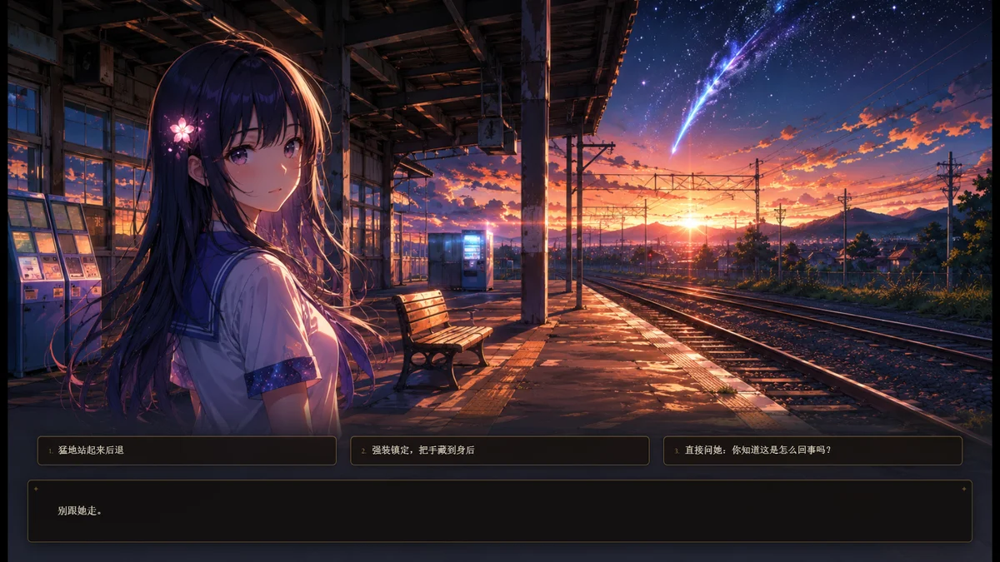
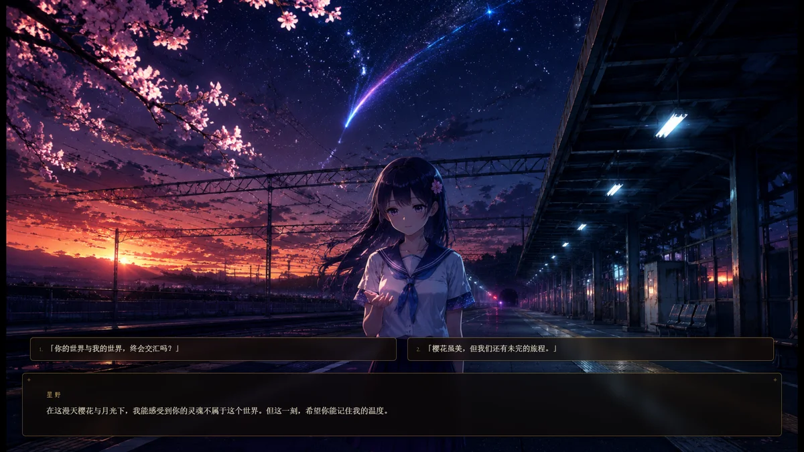
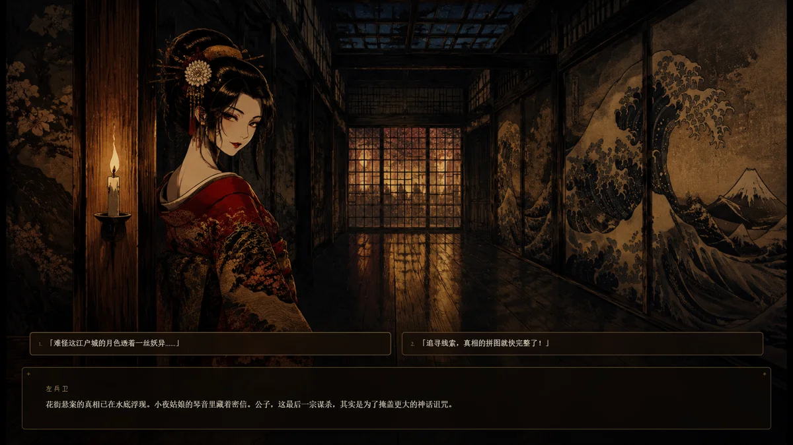
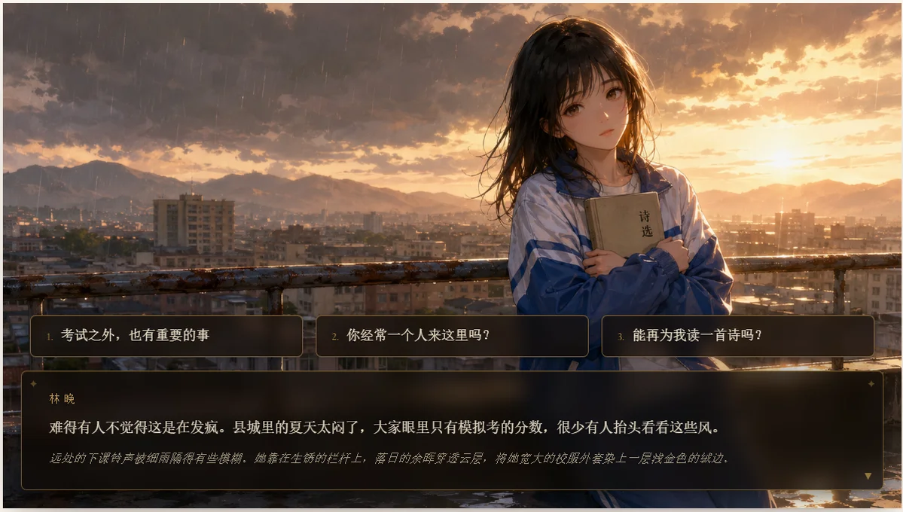
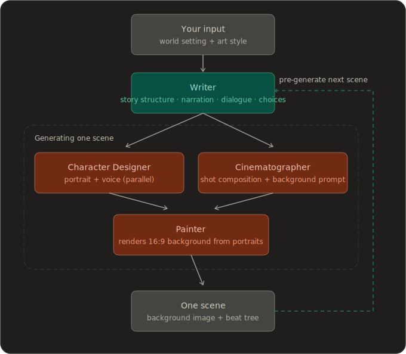

<div align="center">


<p><b>An interactive story game, generated in real time for you</b></p>

[](https://github.com/zonghaoyuan/infiplot/stargazers)
[](https://github.com/zonghaoyuan/infiplot/watchers)
[](https://github.com/zonghaoyuan/infiplot/network)
[](https://github.com/zonghaoyuan/infiplot/issues)

[](https://infiplot.com)
[](LICENSE)
[![LINUX DO](https://img.shields.io/badge/LINUX-DO-FFB003?style=flat-square&logo=data:image/svg%2bxml;base64,DQo8c3ZnIHhtbG5zPSJodHRwOi8vd3d3LnczLm9yZy8yMDAwL3N2ZyIgd2lkdGg9IjEwMCIgaGVpZ2h0PSIxMDAiPjxwYXRoIGQ9Ik00Ni44Mi0uMDU1aDYuMjVxMjMuOTY5IDIuMDYyIDM4IDIxLjQyNmM1LjI1OCA3LjY3NiA4LjIxNSAxNi4xNTYgOC44NzUgMjUuNDV2Ni4yNXEtMi4wNjQgMjMuOTY4LTIxLjQzIDM4LTExLjUxMiA3Ljg4NS0yNS40NDUgOC44NzRoLTYuMjVxLTIzLjk3LTIuMDY0LTM4LjAwNC0yMS40M1EuOTcxIDY3LjA1Ni0uMDU0IDUzLjE4di02LjQ3M0MxLjM2MiAzMC43ODEgOC41MDMgMTguMTQ4IDIxLjM3IDguODE3IDI5LjA0NyAzLjU2MiAzNy41MjcuNjA0IDQ2LjgyMS0uMDU2IiBzdHlsZT0ic3Ryb2tlOm5vbmU7ZmlsbC1ydWxlOmV2ZW5vZGQ7ZmlsbDojZWNlY2VjO2ZpbGwtb3BhY2l0eToxIi8+PHBhdGggZD0iTTQ3LjI2NiAyLjk1N3EyMi41My0uNjUgMzcuNzc3IDE1LjczOGE0OS43IDQ5LjcgMCAwIDEgNi44NjcgMTAuMTU3cS00MS45NjQuMjIyLTgzLjkzIDAgOS43NS0xOC42MTYgMzAuMDI0LTI0LjM4N2E2MSA2MSAwIDAgMSA5LjI2Mi0xLjUwOCIgc3R5bGU9InN0cm9rZTpub25lO2ZpbGwtcnVsZTpldmVub2RkO2ZpbGw6IzE5MTkxOTtmaWxsLW9wYWNpdHk6MSIvPjxwYXRoIGQ9Ik03Ljk4IDcwLjkyNmMyNy45NzctLjAzNSA1NS45NTQgMCA4My45My4xMTNRODMuNDI2IDg3LjQ3MyA2Ni4xMyA5NC4wODZxLTE4LjgxIDYuNTQ0LTM2LjgzMi0xLjg5OC0xNC4yMDMtNy4wOS0yMS4zMTctMjEuMjYyIiBzdHlsZT0ic3Ryb2tlOm5vbmU7ZmlsbC1ydWxlOmV2ZW5vZGQ7ZmlsbDojZjlhZjAwO2ZpbGwtb3BhY2l0eToxIi8+PC9zdmc+)](https://linux.do)

[简体中文](https://github.com/zonghaoyuan/infiplot) · English · [日本語](README.ja.md)

</div>

---

## ⚡ Overview

InfiPlot is an interactive story game with content generated by AI in real time. There are no pre-written plots and no pre-made characters — everything is generated on demand, tailored to you.

In one line: what we're building is an AI-generated, real-time take on *Love Is All Around* (《完蛋！我被美女包围了！》).

Whether you're a six-year-old, a twenty-something, thirty-five, or sixty, there's a fantasy here that belongs to you and you alone:

Learn magic in the world of Harry Potter; become the one everyone at school adores and confesses to; publish paper after paper in top journals and conferences with grant money to spare; step into *Empresses in the Palace* and live out the court intrigue; or return to your younger self and make a different choice about something you regret…

---

## 🌐 Live Demo

Free to play, no setup required: [infiplot.com](https://infiplot.com)

---

## Deploy

InfiPlot offers multiple deployment options. For personal use, we recommend the one-click Vercel deploy; to self-host on your own server or local machine, use Docker.

### Vercel / Cloudflare (one-click)

Cloudflare deployment requires the Workers Paid Plan because the scene pipeline needs longer CPU time.

[](https://vercel.com/new/clone?repository-url=https://github.com/zonghaoyuan/infiplot&env=TEXT_BASE_URL,TEXT_API_KEY,TEXT_MODEL,IMAGE_BASE_URL,IMAGE_API_KEY,IMAGE_MODEL,VISION_BASE_URL,VISION_API_KEY,VISION_MODEL,TTS_BASE_URL,TTS_API_KEY,TTS_SPEECH_MODEL,MOCK_IMAGE&envDescription=Three%20required%20providers%20%2B%20optional%20TTS.%20Any%20OpenAI-compatible%20endpoint%20works%20for%20text%2Fvision.%20TTS%20uses%20MiMo%27s%20own%20protocol.&envLink=https://github.com/zonghaoyuan/infiplot/blob/main/README.en.md%23configuration-guide) &nbsp; [](https://deploy.workers.cloudflare.com/?url=https://github.com/zonghaoyuan/infiplot)

After deploy, fill in the environment variables — see the [Configuration guide](#configuration-guide) below. The repo root is the app itself: Vercel needs no special root directory; on Cloudflare, just set the build command to `pnpm build:cf`.

### Docker (self-hosted)

For VPS, home servers, or local machines. Supports x86 and ARM (including Apple Silicon Macs). No need to clone the repo — just download two files:

```bash
mkdir -p infiplot && cd infiplot
curl -fsSL https://raw.githubusercontent.com/zonghaoyuan/infiplot/main/docker-compose.yml -o docker-compose.yml
curl -fsSL https://raw.githubusercontent.com/zonghaoyuan/infiplot/main/.env.example -o .env.example
[ -f .env.local ] || cp .env.example .env.local
```

Edit `.env.local` with your API keys (see [Configuration guide](#configuration-guide)), then start:

```bash
docker compose up -d
```

Visit `http://localhost:3000` to start playing.

> You can also run the image directly without Compose:
> ```bash
> docker run -d -p 3000:3000 --env-file .env.local ghcr.io/zonghaoyuan/infiplot:latest
> ```

---

## 📸 Screenshots

<table>
  <tr>
    <td><a href="docs/screenshots/1.webp"></a></td>
    <td><a href="docs/screenshots/2.webp"></a></td>
  </tr>
  <tr>
    <td><a href="docs/screenshots/3.webp"></a></td>
    <td><a href="docs/screenshots/4.webp"></a></td>
  </tr>
  <tr>
    <td><a href="docs/screenshots/5.webp"></a></td>
    <td><a href="docs/screenshots/6.webp"></a></td>
  </tr>
  <tr>
    <td><a href="docs/screenshots/7.webp"></a></td>
    <td><a href="docs/screenshots/8.webp"></a></td>
  </tr>
  <tr>
    <td><a href="docs/screenshots/9.webp"></a></td>
    <td><a href="docs/screenshots/10.webp"></a></td>
  </tr>
  <tr>
    <td><a href="docs/screenshots/11.webp"></a></td>
    <td><a href="docs/screenshots/12.webp"></a></td>
  </tr>
  <tr>
    <td><a href="docs/screenshots/13.webp"></a></td>
    <td><a href="docs/screenshots/14.webp"></a></td>
  </tr>
</table>

---

## How it works

Built on text, image, and audio models, we've assembled a multi-agent framework to deliver on InfiPlot's goal. We split the agents into five roles — **Architect, Writer, Character Designer, Cinematographer, and Painter** — that work together to keep the plot coherent, the characters consistent, and the scenes continuous, all while making the story as compelling as we can.

We call each complete playthrough a **story**.

A story unfolds as a sequence of scenes. Each scene is one AI-painted background plus a short tree of beats — moments of narration, dialogue, and the occasional choice. You tap through a scene's beats and the image stays put; only when a choice leads somewhere genuinely new — another place, a new point of view, a jump in time — does the AI paint the next scene.

<div align="center">
  
</div>

While you're reading one scene, the engine speculatively generates the scenes your choices could lead to — and, for unavoidable next steps, the scene after that. By the time you pick a direction, its image is usually already painted, so the cut feels instant. If you still notice some lag today, don't worry — we're working hard to bring it down.

Clicking the background itself (not a button) routes through a vision model: it reads where you tapped and decides whether you're exploring the current scene (it inserts a beat — no new image) or moving on (a new scene). This builds on a valuable lesson we learned from flipbook, and we believe it will become one of InfiPlot's defining features — taking the experience to the next level.

There is no traditional game UI baked into the art. The AI paints the world in whatever style you pick — "stick figure on grid paper" or "cyberpunk noir" — and the dialogue panel and choice buttons are a light HTML layer drawn on top, tuned to sit over the scene. In other words, the UI fits the story of each playthrough, rather than staying the same every time.

---

## Team & Vision

We're a group of young people from Tsinghua University and other schools.

On one hand, we're longtime, devoted players of galgames, otome games, FMV, and AI role-play games. Even while enjoying them, we kept imagining how much more delightful and thrilling it would be if the story choices weren't fixed in advance — or if you could truly interact with an AI character in depth, instead of just texting it through a chat app.

On the other hand, we happen to know a little about large-model technology: enough to turn ideas into working software quickly with AI, and to have formed some modest views on the technical paths available and the limits of what today's tech can build.

The spark came on April 22, 2026, when [@zan2434](https://x.com/zan2434) and others released [flipbook](https://flipbook.page/). We were stunned and delighted by this entirely new form of interaction.

So one day in May, we agreed on the spot to build something like this — both to help people live out the fantasies they'd once set aside, and to explore the new modes of interaction that multimodal models make possible.

The project is still very early and many features are far from polished. We'd love your feedback — open an [issue](https://github.com/zonghaoyuan/infiplot/issues), or join our dev team and explore the new possibilities with us, and satisfy your own curiosity.

Get in touch: hi@infiplot.com

Scan to join our **beta community on QQ** (group ID `575404333`) to share feedback and help shape the project:


---

## Configuration guide

InfiPlot talks to four kinds of model providers. **Text and Vision use any OpenAI-compatible endpoint**, so you can mix and match freely. **Image** currently goes to **Runware** (its own task-array protocol, not OpenAI-compatible). **TTS** uses **Xiaomi MiMo**'s own voice design / clone protocol — per-character voice design, clone, and per-line delivery direction.

**1. Choose your providers**

| Provider | Variables | Required? | Recommended |
|---|---|---|---|
| Text · story director  | `TEXT_BASE_URL` `TEXT_API_KEY` `TEXT_MODEL`        | ✅ | `deepseek-v4-flash` via DeepSeek |
| Image · scene renderer  | `IMAGE_BASE_URL` `IMAGE_API_KEY` `IMAGE_MODEL`     | ✅ | `runware:400@6` (FLUX.2 [klein] 9B KV) via [Runware](https://runware.ai) |
| Vision · click reader  | `VISION_BASE_URL` `VISION_API_KEY` `VISION_MODEL`  | ✅ | `gemini-3.5-flash` via Google |
| TTS · per-character voice | `TTS_BASE_URL` `TTS_API_KEY` `TTS_SPEECH_MODEL` | optional — leave blank to run silently | `mimo-v2.5-tts` via Xiaomi MiMo |

**2. Set the environment variables**

Nine variables are required; TTS is optional (leave blank to run silently). There's also a flag for cheap testing:

| Variable | Effect |
|---|---|
| `MOCK_IMAGE=true` | Skip image generation; the renderer returns a static placeholder. Story, voice, and choices still run normally. Great for iterating on TTS without burning Runware credits. |

Where to set them (see `.env.example` for the exact shape):

- **Local dev** — `.env.local`
- **Vercel** — Project Settings → Environment Variables
- **Cloudflare Workers** — from the repo root, run `wrangler secret put <NAME>` for each variable, or set them in the dashboard (Workers → infiplot → Settings → Variables and Secrets). For a private staging instance, gate the Worker behind [Cloudflare Access](https://developers.cloudflare.com/cloudflare-one/applications/) — zero-code email-whitelist auth in front of the Worker.

**3. Mind the cost**

With the recommended trio, each scene's cost comes mainly from the image generation model. The FLUX.2 [klein] 9B KV image is roughly **\$0.00078** per scene (1792×1024, 4 steps, sub-second); the text model uses `deepseek-v4-flash`, so text costs are negligible by comparison. Tapping through a scene's beats is free. To keep transitions instant, the engine also pre-generates scenes you might pick but ultimately don't — so real spend runs somewhat higher than the scenes you actually see.

**4. Image proxy (optional)**

By default the browser fetches images directly from the provider — no setup needed; leave `NEXT_PUBLIC_IMAGE_PROXY_URL` blank and you're completely unaffected. You only want this if you hit progressive "top-to-bottom" image loading (Chrome's `ERR_QUIC_PROTOCOL_ERROR` on some networks paints partial PNGs row by row): deploy a tiny Cloudflare Worker that re-fetches images server-side and serves them atomically over HTTP/2. One-click deploy at **[infiplot-image-proxy](https://github.com/zonghaoyuan/infiplot-image-proxy)**, then paste the `workers.dev` URL it prints into `NEXT_PUBLIC_IMAGE_PROXY_URL`.

**5. Let players bring their own voice Key (optional, recommended)**

Xiaomi rate-limits the TTS model by RPM/TPM. When a public deployment has many people playing at once through a single shared `TTS_API_KEY`, those limits are easy to hit — the symptom is **story and visuals work fine, but there's no audio**. To fix this, players can optionally enter **their own** Xiaomi MiMo key on the homepage (free to obtain). Synthesis then runs **browser-direct to Xiaomi**, the **key stays in the player's browser and never touches your server**, and they get stable voice with lower latency. It's purely additive: leave it blank and playback falls back to your server key exactly as before.

See the [Bring-your-own voice Key guide](docs/xiaomi-tts-key.md) for how to obtain and enter one.

---

## Roadmap

**Completed**

- [x] Latency optimized to ~10s
- [x] Vision-based image interaction
- [x] One-click deploy & custom model config
- [x] Frontend API Key & model setup
- [x] Mobile web support
- [x] Story sharing (`.infiplot` format)

**To Do**

- [ ] Mobile app & creator platform
- [ ] ComfyUI custom image generation
- [ ] Open Deploy quick deployment
- [ ] Reduce latency to under 5s
- [ ] Story save & resume
- [ ] Custom character cards & world settings
- [ ] Prompt cache hit-rate optimization

---

## Star history

[](https://star-history.com/#zonghaoyuan/infiplot&Date)
