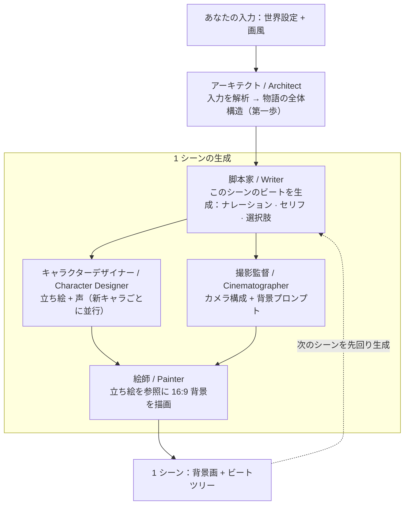

[English](/ "Back to homepage") · [简体中文](README.zh-CN.md) · 日本語

# ⚡ 概要

InfiPlot は、AI がコンテンツをリアルタイムに生成するインタラクティブ・ストーリーゲームです。あらかじめ用意された筋書きもキャラクターもなく、すべてがあなたの求めに応じてその場で生成されます。

ひとことで言えば、私たちが作っているのは、AI がリアルタイムにコンテンツを生成する『Love Is All Around（完蛋！我被美女包围了！）』です。

6 歳の子どもでも、20 代の若者でも、35 歳でも、60 歳でも —— ここには、あなただけのファンタジーがあります：

ハリー・ポッターの世界で魔法を学ぶ。学校で誰もが憧れ、想いを寄せる存在になる。トップ誌・トップ会議に論文を出し続け、研究費にも事欠かない。『宮廷の諍い女（甄嬛传）』の世界で宮廷の駆け引きを味わう。あるいは若い頃に戻り、悔いの残るあの選択をやり直す……

---

## 🌐 ライブデモ

無料でプレイ、セットアップ不要：[infiplot.com](https://infiplot.com)

---

## チームとビジョン

私たちは、清華大学をはじめとする大学に集う若者のグループです。

一方で、私たち自身が galgame、乙女ゲーム、FMV、AI ロールプレイといったゲームのヘビーユーザーでした。楽しみながらも、もし筋書きが固定された選択肢に縛られず、チャットアプリ越しの会話ではなく AI キャラクターと深く関われたら、どれほど愉快で刺激的だろうと想像していました。

もう一方で、私たちはたまたま大規模モデルの技術を少しばかり理解しており、AI でアイデアを素早く形にでき、技術の道筋や既存技術で実現できる製品の限界について、ささやかな考えを持っていました。

きっかけは 2026 年 4 月 22 日、[@zan2434](https://x.com/zan2434) たちが [flipbook](https://flipbook.page/) を公開したことでした。この全く新しいインタラクションの形に、私たちは驚き、心を躍らせました。
そして 5 月のある日、意気投合し、こうした製品を作ろうと決めました —— かつて諦めた幻想を叶える手助けをしつつ、マルチモーダルモデルがもたらす新しいインタラクションの形を探るために。

プロジェクトはまだごく初期で、多くの機能が未完成です。[issue](https://github.com/zonghaoyuan/infiplot/issues) でのフィードバックを歓迎します。あるいは開発チームに加わって、一緒に新たな可能性を探り、あなた自身の好奇心を満たしてください。

お問い合わせ：hi@infiplot.com

---

## 仕組み

テキスト・画像・音声モデルを基盤に、私たちは InfiPlot の目標を実現するためのマルチエージェント・フレームワークを構築しました。エージェントを **アーキテクト（Architect）・脚本家（Writer）・キャラクターデザイナー（Character Designer）・撮影監督（Cinematographer）・絵師（Painter）** の 5 つの役割に分け、互いに連携させることで、物語の一貫性・キャラクターの一貫性・シーンの連続性を保ちつつ、できる限り魅力的な物語を目指します。

一回のプレイ全体を、私たちは**ストーリー（story）**と呼んでいます。

物語は一連のシーン（scene）として展開します。各シーンは、AI が描いた 1 枚の背景画と、短いビート（beat）のツリー —— ナレーション、セリフ、ときおりの選択肢 —— で構成されます。シーン内のビートをタップしていく間、画像はそのまま動きません。選択肢が本当に新しい場所 —— 別の空間、新しい視点、時間の跳躍 —— へ導いたときだけ、AI は次のシーンを描きます。

あなたがひとつのシーンを読んでいる間に、エンジンは選択肢が導きうるシーンを先回りして生成します —— 避けられない次の一歩については、そのさらに先のシーンまで。あなたが方向を選ぶ頃には、その画像はたいてい描き上がっているので、切り替えは一瞬に感じられます。いまはまだ多少の遅延を感じるかもしれませんが、ご安心ください —— 私たちは鋭意改善に取り組んでいます。

ボタンではなく背景そのものをクリックすると、ビジョン（vision）モデルを経由します。タップした位置を読み取り、いまのシーンを探索しているのか（新しい画像なしでビートを挿入）、先へ進もうとしているのか（新しいシーン）を判断します。これは flipbook から学んだ貴重な知見に基づくもので、この機能はいずれ InfiPlot を特徴づける鍵となり、プレイ体験をもう一段引き上げてくれると信じています。

アートの中には、従来型のゲーム UI は一切焼き込まれていません。AI は、あなたが選んだ任意のスタイル —— 「方眼紙の棒人間」でも「サイバーパンク・ノワール」でも —— で世界を描きます。セリフ枠と選択肢ボタンは、その上に重ねた軽量な HTML レイヤーで、シーンになじむよう調整されています。つまり UI は、毎回同じではなく、そのプレイの物語に寄り添って変化するのです。

---

## ワンクリックデプロイ

[](https://vercel.com/new/clone?repository-url=https://github.com/zonghaoyuan/infiplot&root-directory=apps/web&env=TEXT_BASE_URL,TEXT_API_KEY,TEXT_MODEL,IMAGE_BASE_URL,IMAGE_API_KEY,IMAGE_MODEL,VISION_BASE_URL,VISION_API_KEY,VISION_MODEL,TTS_BASE_URL,TTS_API_KEY,TTS_SPEECH_MODEL,MOCK_IMAGE&envDescription=Three%20required%20providers%20%2B%20optional%20TTS.%20Any%20OpenAI-compatible%20endpoint%20works%20for%20text%2Fvision.%20TTS%20uses%20MiMo%27s%20own%20protocol.&envLink=https://github.com/zonghaoyuan/infiplot%23configuration-guide)

デプロイ後、Vercel プロジェクトで環境変数を設定してください —— 下記の[設定ガイド](#設定ガイド)を参照。Vercel プロジェクトの **Root Directory** は `apps/web` に設定する必要があります（デプロイボタンが自動で渡します。手動設定の場合は Project Settings で指定してください）。

---

## 設定ガイド

InfiPlot は 4 種類のモデルプロバイダと通信します。**テキスト（Text）・ビジョン（Vision）は、任意の OpenAI 互換エンドポイント**を使用でき、自由に組み合わせられます。**画像（Image）**は現在 **Runware**（OpenAI 互換ではなく、独自の task-array プロトコル）を使用します。**音声（TTS）**は **Xiaomi MiMo** の独自音声デザイン/クローンプロトコルを使用します —— キャラクターごとの音声デザイン、クローン、行ごとの抑揚指示に対応します。

**1. プロバイダを選ぶ**

| プロバイダ | 環境変数 | 必須？ | 推奨 |
|---|---|---|---|
| Text · ストーリー監督  | `TEXT_BASE_URL` `TEXT_API_KEY` `TEXT_MODEL`        | ✅ | DeepSeek の `deepseek-v4-flash` |
| Image · シーン描画  | `IMAGE_BASE_URL` `IMAGE_API_KEY` `IMAGE_MODEL`     | ✅ | [Runware](https://runware.ai) の `runware:400@6`（FLUX.2 [klein] 9B KV） |
| Vision · クリック解釈  | `VISION_BASE_URL` `VISION_API_KEY` `VISION_MODEL`  | ✅ | Google の `gemini-3.5-flash` |
| TTS · キャラクター音声 | `TTS_BASE_URL` `TTS_API_KEY` `TTS_SPEECH_MODEL` | 任意 —— 空欄なら無音で動作 | Xiaomi MiMo の `mimo-v2.5-tts` |

**2. 環境変数を設定する**

Vercel プロジェクト（**Settings → Environment Variables**）、またはローカル実行時は `apps/web/.env.local` に設定します。9 つの変数が必須で、TTS は任意です（空欄なら無音で動作）。低コストなテスト用のフラグもあります。

| 変数 | 効果 |
|---|---|
| `MOCK_IMAGE=true` | 画像生成をスキップし、レンダラが静的なプレースホルダを返します。ストーリー・音声・選択肢は通常どおり動作します。Runware のクレジットを消費せずに TTS を調整するのに最適です。 |

正確なフォーマットは `apps/web/.env.example` を参照してください。

**3. コストに注意**

推奨の 3 点セットでは、各シーンのコストは主に画像生成モデルによるものです。FLUX.2 [klein] 9B KV の画像は 1 シーンあたり概ね **$0.00078**（1792×1024、4 ステップ、サブ秒）。テキストモデルは `deepseek-v4-flash` を使用するため、テキストコストは比較になりません。シーン内のビートをタップしていくのは無料です。切り替えを一瞬に保つため、エンジンは選ぶ可能性はあるが最終的に選ばないシーンも先行生成します —— そのため実際の支出は、あなたが実際に見るシーン数よりやや高くなります。

---

## Roadmap

- [ ] 生成遅延を体感できないレベルまで下げる
- [ ] より多くのモデルプロバイダに対応
- [ ] プレイ中の自由入力対応
- [ ] モバイルブラウザ対応
- [ ] ユーザー登録・ログイン機能
- [ ] 静止画から動画へのアップグレード
- [ ] 音声インタラクション
- [ ] プレイ中のストーリーを共有
- [ ] モバイルアプリ

---

## スター推移

