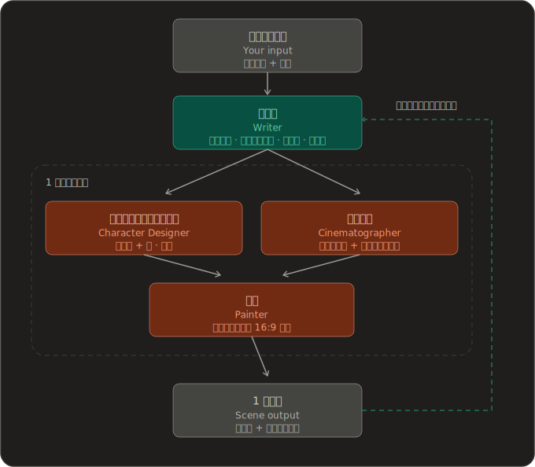

<div align="center">


<p><b>あなたのためにリアルタイム生成されるインタラクティブ・ストーリーゲーム</b></p>

<a href="https://opendeploy.dev/github/zonghaoyuan/infiplot"></a>

[](https://github.com/zonghaoyuan/infiplot/stargazers)
[](https://github.com/zonghaoyuan/infiplot/watchers)
[](https://github.com/zonghaoyuan/infiplot/network)
[](https://github.com/zonghaoyuan/infiplot/issues)

[](https://infiplot.com)
[](LICENSE)
[![LINUX DO](https://img.shields.io/badge/LINUX-DO-FFB003?style=flat-square&logo=data:image/svg%2bxml;base64,DQo8c3ZnIHhtbG5zPSJodHRwOi8vd3d3LnczLm9yZy8yMDAwL3N2ZyIgd2lkdGg9IjEwMCIgaGVpZ2h0PSIxMDAiPjxwYXRoIGQ9Ik00Ni44Mi0uMDU1aDYuMjVxMjMuOTY5IDIuMDYyIDM4IDIxLjQyNmM1LjI1OCA3LjY3NiA4LjIxNSAxNi4xNTYgOC44NzUgMjUuNDV2Ni4yNXEtMi4wNjQgMjMuOTY4LTIxLjQzIDM4LTExLjUxMiA3Ljg4NS0yNS40NDUgOC44NzRoLTYuMjVxLTIzLjk3LTIuMDY0LTM4LjAwNC0yMS40M1EuOTcxIDY3LjA1Ni0uMDU0IDUzLjE4di02LjQ3M0MxLjM2MiAzMC43ODEgOC41MDMgMTguMTQ4IDIxLjM3IDguODE3IDI5LjA0NyAzLjU2MiAzNy41MjcuNjA0IDQ2LjgyMS0uMDU2IiBzdHlsZT0ic3Ryb2tlOm5vbmU7ZmlsbC1ydWxlOmV2ZW5vZGQ7ZmlsbDojZWNlY2VjO2ZpbGwtb3BhY2l0eToxIi8+PHBhdGggZD0iTTQ3LjI2NiAyLjk1N3EyMi41My0uNjUgMzcuNzc3IDE1LjczOGE0OS43IDQ5LjcgMCAwIDEgNi44NjcgMTAuMTU3cS00MS45NjQuMjIyLTgzLjkzIDAgOS43NS0xOC42MTYgMzAuMDI0LTI0LjM4N2E2MSA2MSAwIDAgMSA5LjI2Mi0xLjUwOCIgc3R5bGU9InN0cm9rZTpub25lO2ZpbGwtcnVsZTpldmVub2RkO2ZpbGw6IzE5MTkxOTtmaWxsLW9wYWNpdHk6MSIvPjxwYXRoIGQ9Ik03Ljk4IDcwLjkyNmMyNy45NzctLjAzNSA1NS45NTQgMCA4My45My4xMTNRODMuNDI2IDg3LjQ3MyA2Ni4xMyA5NC4wODZxLTE4LjgxIDYuNTQ0LTM2LjgzMi0xLjg5OC0xNC4yMDMtNy4wOS0yMS4zMTctMjEuMjYyIiBzdHlsZT0ic3Ryb2tlOm5vbmU7ZmlsbC1ydWxlOmV2ZW5vZGQ7ZmlsbDojZjlhZjAwO2ZpbGwtb3BhY2l0eToxIi8+PC9zdmc+)](https://linux.do/t/topic/2296384)

[简体中文](https://github.com/zonghaoyuan/infiplot) · [English](README.en.md) · 日本語

</div>

---

## ⚡ 概要

InfiPlot は、AI がコンテンツをリアルタイムに生成するインタラクティブ・ストーリーゲームです。あらかじめ用意された筋書きもキャラクターもなく、すべてがあなたの求めに応じてその場で生成されます。

ひとことで言えば、私たちが作っているのは、AI がリアルタイムにコンテンツを生成する『Love Is All Around（完蛋！我被美女包围了！）』です。

どんな方でも、ここにはあなただけのファンタジーがあります：

- ハリー・ポッターの世界で魔法を学ぶ
- 学校で誰もが憧れ、想いを寄せる存在になる
- トップ誌・トップ会議に論文を出し続け、研究費にも事欠かない
- 『宮廷の諍い女（甄嬛传）』の世界で宮廷の駆け引きを味わう
- 若い頃に戻り、悔いの残るあの選択をやり直す
- ……

コア機能：

- **マルチエージェント連携** — 脚本家・キャラクターデザイナー・撮影監督・絵師がそれぞれの役割を担い、物語の一貫性とキャラクターの統一感を保つ
- **先読み生成** — あなたが選択する頃には、次のシーンはたいてい描き上がっていて、切り替えは一瞬
- **クリック探索** — 画面のどこでもタップでき、ビジョンモデルがあなたの意図を解釈して応答
- **AI ボイス** — キャラクターごとに固有の声を生成。Xiaomi MiMo（無料）または StepFun（有料・高品質）に対応
- **自由な画風** — 棒人間、サイバーパンク、水彩、漫画……あらゆるスタイルで生成可能

---

## 🌐 ライブデモ

無料でプレイ、セットアップ不要：[infiplot.com](https://infiplot.com)

---

## 📸 スクリーンショット

<table>
  <tr>
    <td><a href="docs/screenshots/1.webp"></a></td>
    <td><a href="docs/screenshots/3.webp"></a></td>
  </tr>
  <tr>
    <td><a href="docs/screenshots/6.webp"></a></td>
    <td><a href="docs/screenshots/8.webp"></a></td>
  </tr>
  <tr>
    <td><a href="docs/screenshots/12.webp"></a></td>
    <td><a href="docs/screenshots/14.webp"></a></td>
  </tr>
</table>

---

## 仕組み

テキスト・画像・音声モデルを基盤に、私たちは InfiPlot の目標を実現するためのマルチエージェント・フレームワークを構築しました。エージェントを **脚本家（Writer）・キャラクターデザイナー（Character Designer）・撮影監督（Cinematographer）・絵師（Painter）** の 4 つの役割に分け、互いに連携させることで、物語の一貫性・キャラクターの一貫性・シーンの連続性を保ちつつ、できる限り魅力的な物語を目指します。脚本家は物語全体の構造設計も兼ねています。

一回のプレイ全体を、私たちは**ストーリー（story）**と呼んでいます。

物語は一連のシーン（scene）として展開します。各シーンは、AI が描いた 1 枚の背景画と、短いビート（beat）のツリー —— ナレーション、セリフ、ときおりの選択肢 —— で構成されます。シーン内のビートをタップしていく間、画像はそのまま動きません。選択肢が本当に新しい場所 —— 別の空間、新しい視点、時間の跳躍 —— へ導いたときだけ、AI は次のシーンを描きます。

<div align="center">
  
</div>

あなたがひとつのシーンを読んでいる間に、エンジンは選択肢が導きうるシーンを先回りして生成します —— 避けられない次の一歩については、そのさらに先のシーンまで。あなたが方向を選ぶ頃には、その画像はたいてい描き上がっているので、切り替えは一瞬に感じられます。いまはまだ多少の遅延を感じるかもしれませんが、ご安心ください —— 私たちは鋭意改善に取り組んでいます。

ボタンではなく背景そのものをクリックすると、ビジョン（vision）モデルを経由します。タップした位置を読み取り、いまのシーンを探索しているのか（新しい画像なしでビートを挿入）、先へ進もうとしているのか（新しいシーン）を判断します。これは flipbook から学んだ貴重な知見に基づくもので、この機能はいずれ InfiPlot を特徴づける鍵となり、プレイ体験をもう一段引き上げてくれると信じています。

アートの中には、従来型のゲーム UI は一切焼き込まれていません。AI は、あなたが選んだ任意のスタイル —— 「方眼紙の棒人間」でも「サイバーパンク・ノワール」でも —— で世界を描きます。セリフ枠と選択肢ボタンは、その上に重ねた軽量な HTML レイヤーで、シーンになじむよう調整されています。つまり UI は、毎回同じではなく、そのプレイの物語に寄り添って変化するのです。

---

## デプロイ

InfiPlot は複数のデプロイ方法に対応しています。個人利用には Vercel のワンクリックデプロイをおすすめします。自分のサーバーやローカルマシンで動かしたい場合は Docker を使ってください。

### OpenDeploy / Vercel / Cloudflare（ワンクリック）

Cloudflare へのデプロイはシーンパイプラインがより長い CPU 時間を必要とするため、Workers Paid Plan が必要です。OpenDeploy では AI エージェントにデプロイを任せることができます。

<a href="https://opendeploy.dev/github/zonghaoyuan/infiplot"></a>&nbsp;
<a href="https://vercel.com/new/clone?repository-url=https://github.com/zonghaoyuan/infiplot&env=TEXT_BASE_URL,TEXT_API_KEY,TEXT_MODEL,IMAGE_BASE_URL,IMAGE_API_KEY,IMAGE_MODEL,VISION_BASE_URL,VISION_API_KEY,VISION_MODEL,TTS_BASE_URL,TTS_API_KEY,TTS_SPEECH_MODEL,MOCK_IMAGE&envDescription=Three%20required%20providers%20%2B%20optional%20TTS.%20Any%20OpenAI-compatible%20endpoint%20works%20for%20text%2Fvision.%20TTS%3A%20Xiaomi%20MiMo%20%28free%29%20or%20StepFun%20%28paid%2C%20better%20quality%29.&envLink=https://github.com/zonghaoyuan/infiplot/blob/main/docs/configuration.ja.md"></a>&nbsp;
<a href="https://deploy.workers.cloudflare.com/?url=https://github.com/zonghaoyuan/infiplot"></a>

デプロイ後、[設定ガイド](docs/configuration.ja.md)に従って環境変数を設定してください。リポジトリのルートがアプリ本体です：Vercel では特別なルート設定は不要です。Cloudflare ではビルドコマンドを `pnpm build:cf` に設定するだけで済みます。

### Docker デプロイ（セルフホスト）

VPS、ホームサーバー、ローカルマシンに対応。x86 と ARM（Apple Silicon Mac を含む）をサポート。リポジトリのクローンは不要です。2 つのファイルをダウンロードするだけで始められます：

```bash
mkdir -p infiplot && cd infiplot
curl -fsSL https://raw.githubusercontent.com/zonghaoyuan/infiplot/main/docker-compose.yml -o docker-compose.yml
curl -fsSL https://raw.githubusercontent.com/zonghaoyuan/infiplot/main/.env.example -o .env.example
[ -f .env.local ] || cp .env.example .env.local
```

`.env.local` を編集して API キーを設定し（[設定ガイド](docs/configuration.ja.md)を参照）、起動します：

```bash
docker compose up -d
```

`http://localhost:3000` にアクセスしてゲームを開始できます。

> Compose を使わず、直接イメージを実行することもできます：
> ```bash
> docker run -d -p 3000:3000 --env-file .env.local ghcr.io/zonghaoyuan/infiplot:latest
> ```

---

## Roadmap

**実装済み**

- [x] レイテンシを約 10 秒に最適化
- [x] ビジョンベース画像インタラクション
- [x] ワンクリックデプロイ＆カスタムモデル設定
- [x] フロントエンドで API Key・モデル設定
- [x] モバイル Web 対応
- [x] ストーリー共有（`.infiplot` 形式）
- [x] OpenDeploy クイックデプロイ
- [x] ストーリーの保存・再開（ローカル + クラウド同期）

**未実装**

- [ ] モバイルアプリ＆クリエイタープラットフォーム
- [ ] ComfyUI カスタム画像生成対応
- [ ] レイテンシを 5 秒以内に短縮
- [ ] カスタムキャラクターカード＆世界観設定
- [ ] プロンプトキャッシュヒット率の最適化

---

## チームとビジョン

私たちは、清華大学をはじめとする大学に集う若者のグループです。

一方で、私たち自身が galgame、乙女ゲーム、FMV、AI ロールプレイといったゲームのヘビーユーザーでした。楽しみながらも、もし筋書きが固定された選択肢に縛られず、チャットアプリ越しの会話ではなく AI キャラクターと深く関われたら、どれほど愉快で刺激的だろうと想像していました。

もう一方で、私たちはたまたま大規模モデルの技術を少しばかり理解しており、AI でアイデアを素早く形にでき、技術の道筋や既存技術で実現できる製品の限界について、ささやかな考えを持っていました。

きっかけは 2026 年 4 月 22 日、[@zan2434](https://x.com/zan2434) たちが [flipbook](https://flipbook.page/) を公開したことでした。この全く新しいインタラクションの形に、私たちは驚き、心を躍らせました。
そして 5 月のある日、意気投合し、こうした製品を作ろうと決めました —— かつて諦めた幻想を叶える手助けをしつつ、マルチモーダルモデルがもたらす新しいインタラクションの形を探るために。

プロジェクトはまだごく初期で、多くの機能が未完成です。[issue](https://github.com/zonghaoyuan/infiplot/issues) でのフィードバックを歓迎します。あるいは開発チームに加わって、一緒に新たな可能性を探り、あなた自身の好奇心を満たしてください。

お問い合わせ：hi@infiplot.com

**InfiPlot ベータ交流グループ**（QQ グループ番号 `575404333`）—— QR コードを読み取って参加し、フィードバックや共同開発にご参加ください：


---

## スター推移

[](https://star-history.com/#zonghaoyuan/infiplot&Date)

---

## ライセンスとコントリビュート

本プロジェクトは [AGPL-3.0](https://www.gnu.org/licenses/agpl-3.0.html) で公開されています。

コントリビューションを歓迎します！外部コントリビュータは、PR をマージする前に一度だけ《貢献者ライセンス契約》（CLA）に署名する必要があります —— [CONTRIBUTING.md](CONTRIBUTING.md) および [CLA.md](CLA.md) を参照してください。PR を開いた後、PR のコメントで署名できます。
