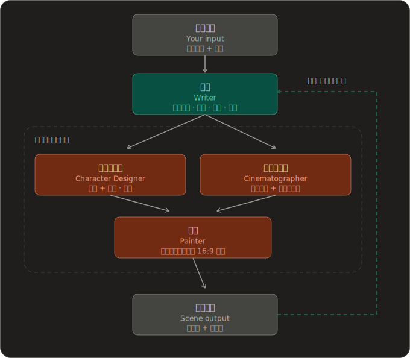

<div align="center">


<p><b>为你实时生成的互动剧情游戏</b></p>

<a href="https://opendeploy.dev/github/zonghaoyuan/infiplot"></a>

[](https://github.com/zonghaoyuan/infiplot/stargazers)
[](https://github.com/zonghaoyuan/infiplot/watchers)
[](https://github.com/zonghaoyuan/infiplot/network)
[](https://github.com/zonghaoyuan/infiplot/issues)

[](https://infiplot.com)
[](LICENSE)
[![LINUX DO](https://img.shields.io/badge/LINUX-DO-FFB003?style=flat-square&logo=data:image/svg%2bxml;base64,DQo8c3ZnIHhtbG5zPSJodHRwOi8vd3d3LnczLm9yZy8yMDAwL3N2ZyIgd2lkdGg9IjEwMCIgaGVpZ2h0PSIxMDAiPjxwYXRoIGQ9Ik00Ni44Mi0uMDU1aDYuMjVxMjMuOTY5IDIuMDYyIDM4IDIxLjQyNmM1LjI1OCA3LjY3NiA4LjIxNSAxNi4xNTYgOC44NzUgMjUuNDV2Ni4yNXEtMi4wNjQgMjMuOTY4LTIxLjQzIDM4LTExLjUxMiA3Ljg4NS0yNS40NDUgOC44NzRoLTYuMjVxLTIzLjk3LTIuMDY0LTM4LjAwNC0yMS40M1EuOTcxIDY3LjA1Ni0uMDU0IDUzLjE4di02LjQ3M0MxLjM2MiAzMC43ODEgOC41MDMgMTguMTQ4IDIxLjM3IDguODE3IDI5LjA0NyAzLjU2MiAzNy41MjcuNjA0IDQ2LjgyMS0uMDU2IiBzdHlsZT0ic3Ryb2tlOm5vbmU7ZmlsbC1ydWxlOmV2ZW5vZGQ7ZmlsbDojZWNlY2VjO2ZpbGwtb3BhY2l0eToxIi8+PHBhdGggZD0iTTQ3LjI2NiAyLjk1N3EyMi41My0uNjUgMzcuNzc3IDE1LjczOGE0OS43IDQ5LjcgMCAwIDEgNi44NjcgMTAuMTU3cS00MS45NjQuMjIyLTgzLjkzIDAgOS43NS0xOC42MTYgMzAuMDI0LTI0LjM4N2E2MSA2MSAwIDAgMSA5LjI2Mi0xLjUwOCIgc3R5bGU9InN0cm9rZTpub25lO2ZpbGwtcnVsZTpldmVub2RkO2ZpbGw6IzE5MTkxOTtmaWxsLW9wYWNpdHk6MSIvPjxwYXRoIGQ9Ik03Ljk4IDcwLjkyNmMyNy45NzctLjAzNSA1NS45NTQgMCA4My45My4xMTNRODMuNDI2IDg3LjQ3MyA2Ni4xMyA5NC4wODZxLTE4LjgxIDYuNTQ0LTM2LjgzMi0xLjg5OC0xNC4yMDMtNy4wOS0yMS4zMTctMjEuMjYyIiBzdHlsZT0ic3Ryb2tlOm5vbmU7ZmlsbC1ydWxlOmV2ZW5vZGQ7ZmlsbDojZjlhZjAwO2ZpbGwtb3BhY2l0eToxIi8+PC9zdmc+)](https://linux.do/t/topic/2296384)

[English](README.en.md) · 简体中文 · [日本語](README.ja.md)

</div>

---

## ⚡ 概览

InfiPlot是一款AI实时生成内容的互动剧情游戏，这里没有预设好的剧情、角色，所有内容都根据你的需求定制化的生成。

用一句话说，我们要做的是一款用AI实时生成内容的《完蛋！我被美女包围了！》

无论你是六岁的小朋友，20岁的年轻人，35岁的青年还是60岁的长者，都能在这里满足独属于你的幻想：

穿越到哈利波特世界学习魔法、成为学校里所有异性青睐和表达爱意的对象、顶刊顶会发不停科研经费拿到手软、穿越到甄嬛传体验宫廷斗争、或者重返年轻为遗憾的事情重新做选择......

---

## 🌐 在线体验

免费在线试玩，无需本地部署：[infiplot.com](https://infiplot.com)

---

## 部署

InfiPlot 支持多种部署方式。个人使用推荐 Vercel 一键部署；想部署到自己的服务器或本地运行，可以用 Docker。

### OpenDeploy / Vercel / Cloudflare（一键部署）

Cloudflare 部署因场景流水线需要更长 CPU 时间，需要 Workers Paid Plan。OpenDeploy 支持让 AI Agent 帮你完成部署。

<a href="https://opendeploy.dev/github/zonghaoyuan/infiplot"></a>&nbsp;
<a href="https://vercel.com/new/clone?repository-url=https://github.com/zonghaoyuan/infiplot&env=TEXT_BASE_URL,TEXT_API_KEY,TEXT_MODEL,IMAGE_BASE_URL,IMAGE_API_KEY,IMAGE_MODEL,VISION_BASE_URL,VISION_API_KEY,VISION_MODEL,TTS_BASE_URL,TTS_API_KEY,TTS_SPEECH_MODEL,MOCK_IMAGE&envDescription=Three%20required%20providers%20%2B%20optional%20TTS.%20Any%20OpenAI-compatible%20endpoint%20works%20for%20text%2Fvision.%20TTS%3A%20Xiaomi%20MiMo%20%28free%29%20or%20StepFun%20%28paid%2C%20better%20quality%29.&envLink=https://github.com/zonghaoyuan/infiplot%23%E9%85%8D%E7%BD%AE%E6%95%99%E7%A8%8B"></a>&nbsp;
<a href="https://deploy.workers.cloudflare.com/?url=https://github.com/zonghaoyuan/infiplot"></a>

部署完成后，填好环境变量 —— 详见下方的[配置教程](#配置教程)。仓库根目录就是应用本身：Vercel 无需额外设置 root directory；在 Cloudflare 上把构建命令设为 `pnpm build:cf` 即可。

### Docker 部署（自托管）

适用于 VPS、家庭服务器或本地电脑。支持 x86 和 ARM（含 Apple Silicon Mac）。无需克隆仓库，只需下载两个文件：

```bash
mkdir -p infiplot && cd infiplot
curl -fsSL https://raw.githubusercontent.com/zonghaoyuan/infiplot/main/docker-compose.yml -o docker-compose.yml
curl -fsSL https://raw.githubusercontent.com/zonghaoyuan/infiplot/main/.env.example -o .env.example
[ -f .env.local ] || cp .env.example .env.local
```

编辑 `.env.local` 填入你的 API Key（详见[配置教程](#配置教程)），然后启动：

```bash
docker compose up -d
```

访问 `http://localhost:3000` 即可开始游戏。

> 也可以不用 Compose，直接运行镜像：
> ```bash
> docker run -d -p 3000:3000 --env-file .env.local ghcr.io/zonghaoyuan/infiplot:latest
> ```

---

## 📸 游戏截图

<table>
  <tr>
    <td><a href="docs/screenshots/1.webp"></a></td>
    <td><a href="docs/screenshots/2.webp"></a></td>
  </tr>
  <tr>
    <td><a href="docs/screenshots/3.webp"></a></td>
    <td><a href="docs/screenshots/4.webp"></a></td>
  </tr>
  <tr>
    <td><a href="docs/screenshots/5.webp"></a></td>
    <td><a href="docs/screenshots/6.webp"></a></td>
  </tr>
  <tr>
    <td><a href="docs/screenshots/7.webp"></a></td>
    <td><a href="docs/screenshots/8.webp"></a></td>
  </tr>
  <tr>
    <td><a href="docs/screenshots/9.webp"></a></td>
    <td><a href="docs/screenshots/10.webp"></a></td>
  </tr>
  <tr>
    <td><a href="docs/screenshots/11.webp"></a></td>
    <td><a href="docs/screenshots/12.webp"></a></td>
  </tr>
  <tr>
    <td><a href="docs/screenshots/13.webp"></a></td>
    <td><a href="docs/screenshots/14.webp"></a></td>
  </tr>
</table>

---

## 工作原理

基于文本、图像和音频模型，我们搭建了一个多智能体框架来实现InfiPlot的目标。我们把agent分为编剧、角色设计师、场景布置师和画家四个职能，让他们之间相互配合，在保证剧情连贯性、角色一致性、场景一致性的基础上，尽可能使得剧情足够富有吸引力。其中编剧同时负责剧情的整体架构规划。

我们把每一次游玩的整体体验称为故事（story）。

故事以一连串场景（scene）的形式展开。每个场景由一张 AI 绘制的背景图，加上一棵简短的节拍（beat）树组成 —— 也就是旁白、对话和偶尔出现的选项。你逐拍点过一个场景时，画面始终不变；只有当某个选项把你带到真正全新的地方 —— 换了空间、换了视角、跳跃了时间 —— AI 才会绘制下一幕场景。

<div align="center">
  
</div>

当你正在阅读一幕场景时，引擎会预测式地生成你的选项可能通向的那些场景 —— 对于无法回避的下一步，还会再往前生成一幕。等你真正选定方向时，那一幕的图通常已经画好了，于是切换瞬间完成、毫无停顿。如果你现在仍然感到有些延迟，别担心，我们正在努力优化它。

直接点击背景本身（而非按钮）会走一个视觉（vision）模型：它读取你点击的位置，判断你是在探索当前场景（于是插入一个节拍 —— 不生成新图），还是要继续前进（生成一幕新场景）。这是基于我们从flipbook那里学到的宝贵认知，我们相信这个功能会在未来成为InfiPlot的关键功能，让你的游玩体验更上一层楼。

未来，画面里将没有烤进任何传统的游戏 UI。AI 会用你选择的任意风格来描绘整个世界 —— 「方格纸上的火柴人」也好，「赛博朋克黑色电影」也罢 —— 而对话框和选项按钮，只是叠在画面之上、并为贴合场景而精心调校过的一层轻量 HTML。也就是说，每次游玩时，UI都会契合当前的故事，而不是一成不变。

---

## 团队与愿景

我们是一群来自清华大学、兰州大学等高校的年轻人。

一方面，我们本来就是galgame、乙女游戏、FMV、AI角色扮演游戏这类游戏的深度用户，在享受游戏体验的同时，也会想象如果能选择不被预设的剧情选项，或者和对话的AI角色深度互动而不只是通过聊天软件聊天，该是多么愉快刺激的体验。

另一方面，我们恰好又对大模型技术有些了解，能用AI快速实现想法，对技术路线和基于已有技术的产品能力边界有一些浅薄的思考。

契机发生在 2026 年 4 月 22 日，[@zan2434](https://x.com/zan2434) 等人发布了 [flipbook](https://flipbook.page/)，我们对这种全新的交互形态感到震惊和欣喜。
于是在 5 月的某一天，我们一拍即合，决定做一款这样的产品，既帮助大家满足那些曾经遗憾过的幻想，又能够探索多模态模型所带来的新的交互形态。

目前我们的项目还很早期，有许多功能尚不完善，欢迎提交 [issues](https://github.com/zonghaoyuan/infiplot/issues) 反馈问题，或者加入我们的开发团队一起探索新的可能性，满足你的好奇心。

联系方式：hi@infiplot.com

欢迎扫码加入 **InfiPlot 公测交流群**（QQ 群号 `575404333`），一起反馈体验、参与共建：


---

## 配置教程

InfiPlot 会与四类模型供应商通信。**文本（Text）和视觉（Vision）** 只走 OpenAI 兼容接口——想用 Google Gemini 的话，把 `*_BASE_URL` 指向其 OpenAI 兼容端点（`https://generativelanguage.googleapis.com/v1beta/openai`）即可；想用 Anthropic Claude 的话，推荐通过兼容网关（如 LiteLLM）转发，官方 OpenAI 兼容层不支持缓存，可能推高成本与延迟。**图像（Image）** 支持 **Runware**（其自有 task-array 协议）与 **OpenAI**（`gpt-image`）。**语音（TTS）** 支持**小米 MiMo**（自有的音色设计/克隆协议——支持角色级音色设计、克隆与逐行演绎指导，免费）和 **StepFun 阶跃星辰**（32 个预设音色，由 AI 自动匹配，付费但体验更好）。

**1. 选择你的供应商**

| 供应商 | 环境变量 | 是否必填 | 推荐 |
|---|---|---|---|
| Text · 剧情导演  | `TEXT_BASE_URL` `TEXT_API_KEY` `TEXT_MODEL`        | ✅ | DeepSeek 的 `deepseek-v4-flash` |
| Image · 场景渲染  | `IMAGE_BASE_URL` `IMAGE_API_KEY` `IMAGE_MODEL`     | ✅ | [Runware](https://runware.ai) 的 `runware:400@6`（FLUX.2 [klein] 9B KV） |
| Vision · 点击解读  | `VISION_BASE_URL` `VISION_API_KEY` `VISION_MODEL`  | ✅ | Google 的 `gemini-3.5-flash` |
| TTS · 角色配音 | `TTS_BASE_URL` `TTS_API_KEY` `TTS_SPEECH_MODEL` | 可选 —— 留空则静音运行 | 小米 MiMo 的 `mimo-v2.5-tts`（免费）；付费可选 [StepFun](https://www.stepfun.com) 的 `step-tts-2` |

> **可选 · 指定接口协议**：每类模型都可加一个 `*_PROVIDER` 变量（`TEXT_PROVIDER` / `VISION_PROVIDER` / `IMAGE_PROVIDER`）显式选择接口协议。**不设则保持向后兼容**——文本/视觉默认走 OpenAI 兼容接口，图像按 `*_BASE_URL` 自动判断（`runware.ai` → Runware，否则 OpenAI 兼容；个别在 `runware.ai` 上以 OpenAI 协议提供的模型——如 `image-2-vip`——会按 OpenAI 兼容处理，需要时用 `IMAGE_PROVIDER` 显式覆盖即可）。
>
> | 取值 | 适用 | 说明 |
> |---|---|---|
> | `openai_compatible`（默认） | Text · Vision · Image | OpenAI Chat Completions / `/images/generations` |
> | `openai` | Image | OpenAI `gpt-image`，支持参考图编辑 |
> | `runware` | Image | Runware task-array 协议 |
>
> 文本和视觉**仅**支持 `openai_compatible`。要用 Gemini，把 `*_BASE_URL` 指向其 OpenAI 兼容端点（`https://generativelanguage.googleapis.com/v1beta/openai`）即可。要用 Claude，推荐通过兼容网关（如 LiteLLM）转发——Anthropic 官方端点虽提供 OpenAI 兼容层，但不支持缓存，会推高成本与延迟。
>
> 此外，`*_BASE_URL` 带不带 `/v1`（甚至末尾多写了 `/chat/completions`）都能正常工作——引擎会自动规范化。

**2. 填写环境变量**

九个变量为必填；TTS 可选（留空则静音运行）。此外还有一个用于低成本测试的开关：

| 变量 | 作用 |
|---|---|
| `MOCK_IMAGE=true` | 跳过图像生成，渲染器返回一张静态占位图。剧情、语音、选项照常运行。非常适合在不消耗 Runware 额度的情况下调试 TTS。 |

在哪里设置（确切字段见 `.env.example`）：

- **本地开发** —— `.env.local`
- **Vercel** —— Project Settings → Environment Variables
- **Cloudflare Workers** —— 在仓库根目录下逐个执行 `wrangler secret put <NAME>`，或在 dashboard 里设置（Workers → infiplot → Settings → Variables and Secrets）。如果要给 staging 加访问限制，可以在 Worker 前面挂一个 [Cloudflare Access](https://developers.cloudflare.com/cloudflare-one/applications/)（零代码，邮箱白名单）。

**3. 注意成本**

使用推荐的三件套时，每一幕场景的开销主要来自图像生成模型。FLUX.2 [klein] 9B KV 的图像大约 **$0.00078** 一张（1792×1024，4 步，亚秒级）；文本模型使用 `deepseek-v4-flash` 时，成本极低。逐拍点过一个场景是免费的。为了让切换瞬间完成，引擎还会预测式地生成那些你可能选、但最终可能没选的场景 —— 所以真实花费会比你实际看到的场景数略高一些。

**4. 图片代理（可选）**

默认浏览器直连图片供应商，无需任何配置 —— 留空 `NEXT_PUBLIC_IMAGE_PROXY_URL` 即可，完全不受影响。只有当你遇到图片「层层加载」（Chrome 在某些网络下 `ERR_QUIC_PROTOCOL_ERROR` 导致 PNG 逐行渲染）时才需要它：部署一个极小的 Cloudflare Worker，把图片改为服务端转发 + HTTP/2 原子返回。一键部署见 **[infiplot-image-proxy](https://github.com/zonghaoyuan/infiplot-image-proxy)**，然后把它给出的 `workers.dev` 地址填进 `NEXT_PUBLIC_IMAGE_PROXY_URL`。

**5. 玩家自带配音 Key（可选，推荐）**

小米对 TTS 模型有 RPM/TPM 限额。当你的公共部署有多人同时游玩、共用同一把 `TTS_API_KEY` 时，很容易撞到限额，表现为**剧情、画面都正常，唯独没有声音**。为此，玩家可以在首页可选地填入**自己的**小米 MiMo Key（免费申请）——配音请求由**浏览器直连小米**完成，**Key 只存在玩家本地、绝不经过你的服务器**，从而获得稳定配音与更低延迟。这是纯增强：不填则照常使用你部署的服务器 Key，行为不变。

申请与填写步骤见 [自带配音 Key 教程](docs/xiaomi-tts-key.md)。

---

## Roadmap

**已实现**

- [x] 延迟优化至约 10 秒
- [x] 视觉识图交互
- [x] 一键部署与自定义模型配置
- [x] 前端直配 API Key 与模型
- [x] 移动端 Web 适配
- [x] 剧情分享（`.infiplot` 格式）
- [x] OpenDeploy 快速部署
- [x] 剧情存档与续玩（本地 + 云端同步）

**未实现**

- [ ] 移动端 App 与创作平台
- [ ] 兼容 ComfyUI 自定义生图
- [ ] 延迟压缩至 5 秒以内
- [ ] 自定义角色卡与世界观
- [ ] Prompt 缓存命中率优化

---

## Star 趋势

[](https://star-history.com/#zonghaoyuan/infiplot&Date)

---

## 协议与贡献

本项目基于 [AGPL-3.0](https://www.gnu.org/licenses/agpl-3.0.html) 协议开源。

欢迎贡献！外部贡献者在 PR 合并前，需要签署一次我们的《贡献者许可协议》（CLA）——详见 [CONTRIBUTING.md](CONTRIBUTING.md) 与 [CLA.md](CLA.md)（[中文参考译文](CLA.zh.md)）。
