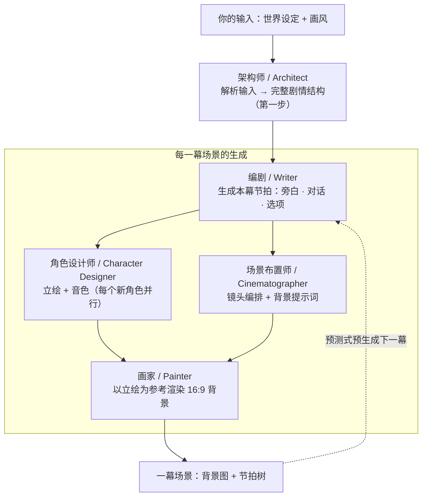

[English](https://github.com/zonghaoyuan/infiplot "Back to homepage") · 简体中文 · [日本語](README.ja.md)

# ⚡ 概览

InfiPlot是一款AI实时生成内容的互动剧情游戏，这里没有预设好的剧情、角色，所有内容都根据你的需求定制化的生成。

用一句话说，我们要做的是一款用AI实时生成内容的《完蛋！我被美女包围了！》

无论你是六岁的小朋友，20岁的年轻人，35岁的青年还是60岁的长者，都能在这里满足独属于你的幻想：

穿越到哈利波特世界学习魔法、成为学校里所有异性青睐和表达爱意的对象、顶刊顶会发不停科研经费拿到手软、穿越到甄嬛传体验宫廷斗争、或者重返年轻为遗憾的事情重新做选择......

---

## 🌐 在线体验

免费在线试玩，无需本地部署：[infiplot.com](https://infiplot.com)

---

## 团队与愿景

我们是一群来自清华大学等高校的年轻人。

一方面，我们本来就是galgame、乙女游戏、FMV、AI角色扮演游戏这类游戏的深度用户，在享受游戏体验的同时，也会想象如果能选择不被预设的剧情选项，或者和对话的AI角色深度互动而不只是通过聊天软件聊天，该是多么愉快刺激的体验。

另一方面，我们恰好又对大模型技术有些了解，能用AI快速实现想法，对技术路线和基于已有技术的产品能力边界有一些浅薄的思考。

契机发生在 2026 年 4 月 22 日，[@zan2434](https://x.com/zan2434) 等人发布了 [flipbook](https://flipbook.page/)，我们对这种全新的交互形态感到震惊和欣喜。
于是在 5 月的某一天，我们一拍即合，决定做一款这样的产品，既帮助大家满足那些曾经遗憾过的幻想，又能够探索多模态模型所带来的新的交互形态。

目前我们的项目还很早期，有许多功能尚不完善，欢迎提交 [issues](https://github.com/zonghaoyuan/infiplot/issues) 反馈问题，或者加入我们的开发团队一起探索新的可能性，满足你的好奇心。

联系方式：hi@infiplot.com

---

## 工作原理

基于文本、图像和音频模型，我们搭建了一个多智能体框架来实现InfiPlot的目标。我们把agent分为架构师、编剧、角色设计师、场景布置师和画家五个职能，让他们之间相互配合，在保证剧情连贯性、角色一致性、场景一致性的基础上，尽可能使得剧情足够富有吸引力。

我们把每一次游玩的整体体验称为故事（story）。

故事以一连串场景（scene）的形式展开。每个场景由一张 AI 绘制的背景图，加上一棵简短的节拍（beat）树组成 —— 也就是旁白、对话和偶尔出现的选项。你逐拍点过一个场景时，画面始终不变；只有当某个选项把你带到真正全新的地方 —— 换了空间、换了视角、跳跃了时间 —— AI 才会绘制下一幕场景。

当你正在阅读一幕场景时，引擎会预测式地生成你的选项可能通向的那些场景 —— 对于无法回避的下一步，还会再往前生成一幕。等你真正选定方向时，那一幕的图通常已经画好了，于是切换瞬间完成、毫无停顿。如果你现在仍然感到有些延迟，别担心，我们正在努力优化它。

直接点击背景本身（而非按钮）会走一个视觉（vision）模型：它读取你点击的位置，判断你是在探索当前场景（于是插入一个节拍 —— 不生成新图），还是要继续前进（生成一幕新场景）。这是基于我们从flipbook那里学到的宝贵认知，我们相信这个功能会在未来成为InfiPlot的关键功能，让你的游玩体验更上一层楼。

未来，画面里将没有烤进任何传统的游戏 UI。AI 会用你选择的任意风格来描绘整个世界 —— 「方格纸上的火柴人」也好，「赛博朋克黑色电影」也罢 —— 而对话框和选项按钮，只是叠在画面之上、并为贴合场景而精心调校过的一层轻量 HTML。也就是说，每次游玩时，UI都会契合当前的故事，而不是一成不变。

---

## 一键部署

[](https://vercel.com/new/clone?repository-url=https://github.com/zonghaoyuan/infiplot&root-directory=apps/web&env=TEXT_BASE_URL,TEXT_API_KEY,TEXT_MODEL,IMAGE_BASE_URL,IMAGE_API_KEY,IMAGE_MODEL,VISION_BASE_URL,VISION_API_KEY,VISION_MODEL,TTS_BASE_URL,TTS_API_KEY,TTS_SPEECH_MODEL,MOCK_IMAGE&envDescription=Three%20required%20providers%20%2B%20optional%20TTS.%20Any%20OpenAI-compatible%20endpoint%20works%20for%20text%2Fvision.%20TTS%20uses%20MiMo%27s%20own%20protocol.&envLink=https://github.com/zonghaoyuan/infiplot%23configuration-guide)

部署完成后，在 Vercel 项目里填好环境变量 —— 详见下方的[配置教程](#配置教程)。Vercel 项目的 **Root Directory** 必须设为 `apps/web`（一键部署按钮会自动带上；若手动配置，请在 Project Settings 里设置）。

---

## 配置教程

InfiPlot 会与四类模型供应商通信。**文本（Text）和视觉（Vision）都使用 OpenAI 兼容的接口**，可以自由搭配。**图像（Image）**目前接入 **Runware**（其自有的 task-array 协议，并非 OpenAI 兼容）。**语音（TTS）**使用**小米 MiMo** 自有的音色设计/克隆协议——支持角色级音色设计、克隆与逐行演绎指导。

**1. 选择你的供应商**

| 供应商 | 环境变量 | 是否必填 | 推荐 |
|---|---|---|---|
| Text · 剧情导演  | `TEXT_BASE_URL` `TEXT_API_KEY` `TEXT_MODEL`        | ✅ | DeepSeek 的 `deepseek-v4-flash` |
| Image · 场景渲染  | `IMAGE_BASE_URL` `IMAGE_API_KEY` `IMAGE_MODEL`     | ✅ | [Runware](https://runware.ai) 的 `runware:400@6`（FLUX.2 [klein] 9B KV） |
| Vision · 点击解读  | `VISION_BASE_URL` `VISION_API_KEY` `VISION_MODEL`  | ✅ | Google 的 `gemini-3.5-flash` |
| TTS · 角色配音 | `TTS_BASE_URL` `TTS_API_KEY` `TTS_SPEECH_MODEL` | 可选 —— 留空则静音运行 | 小米 MiMo 的 `mimo-v2.5-tts` |

**2. 填写环境变量**

在 Vercel 项目里设置（**Settings → Environment Variables**），或在本地运行时写进 `apps/web/.env.local`。九个变量为必填；TTS 可选（留空则静音运行）。此外还有一个用于低成本测试的开关：

| 变量 | 作用 |
|---|---|
| `MOCK_IMAGE=true` | 跳过图像生成，渲染器返回一张静态占位图。剧情、语音、选项照常运行。非常适合在不消耗 Runware 额度的情况下调试 TTS。 |

确切的字段格式见 `apps/web/.env.example`。

**3. 注意成本**

使用推荐的三件套时，每一幕场景的开销主要来自图像生成模型。FLUX.2 [klein] 9B KV 的图像大约 **$0.00078** 一张（1792×1024，4 步，亚秒级）；文本模型使用 `deepseek-v4-flash` 时，成本极低。逐拍点过一个场景是免费的。为了让切换瞬间完成，引擎还会预测式地生成那些你可能选、但最终可能没选的场景 —— 所以真实花费会比你实际看到的场景数略高一些。

---

## Roadmap

- [ ] 让用户感知不到生成延迟
- [ ] 兼容更多模型 provider
- [ ] 游玩过程中支持用户自定义输入
- [ ] 移动端浏览器适配
- [ ] 用户注册登录系统
- [ ] 由静态图升级为动态视频
- [ ] 语音交互
- [ ] 分享正在游玩的故事
- [ ] 移动端 app

---

## Star 趋势

